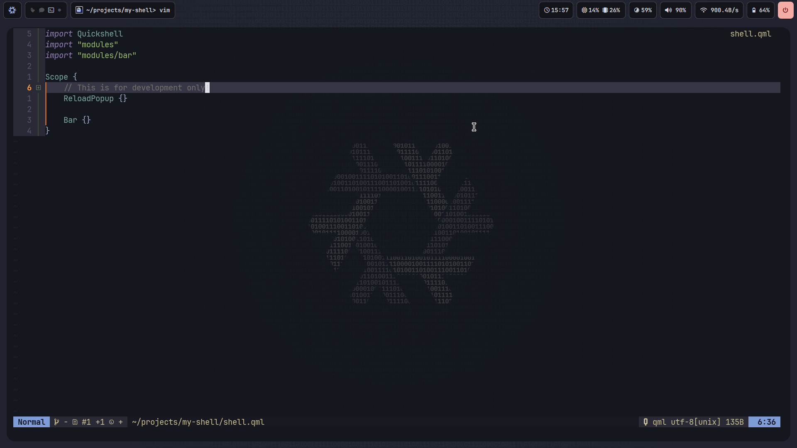
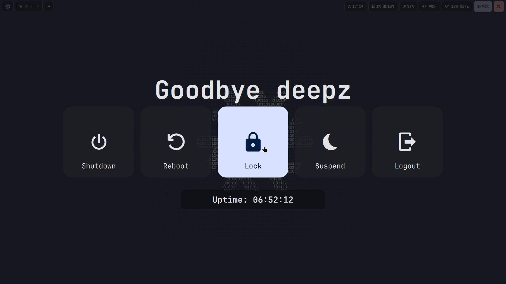
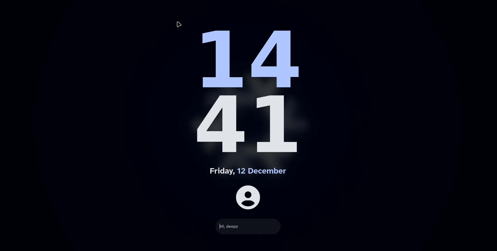

# Sheez Shell

[](https://nixos.org/)
[](https://opensource.org/licenses/MIT)

Sheez is a minimal, extensible desktop bar built with [Quickshell](https://git.outfoxxed.me/outfoxxed/quickshell) - a Qt/QML-based framework for creating Wayland desktop shells. Currently focused on providing a feature-rich bar component, it's designed to grow into a full shell ecosystem.

## Features

- **Smooth animations**: Polished transitions and hover effects
- **Supported compositors**: Niri and Hyprland
- **Dynamic theming**: Automatic color generation from wallpapers using [matugen](https://github.com/InioX/matugen)
- **Logout Menu**: Power management interface providing shutdown, reboot, lock, suspend, and logout options with keyboard shortcuts
- **Lockscreen**: Secure session locking with Wayland protocol support

## Screenshots





## Installation

### Prerequisites

- Matugen
- Nix with flakes enabled
- Wayland compositor (Hyprland or Niri)

### Setup matugen

First, copy the [colors-template.json](./colors-template.json) file to somewhere you like.
Then you will need to add the following configuration to your `config.toml`:

```toml
[templates.sheez]
input_path = 'path/to/colors-template.json'
output_path = '~/.config/sheez/colors.json'
```

After that, you can use `matugen image <your_wallpaper_here>`
to change generate the `colors.json`.

### Usage with Nix Flakes

Add sheez to your flake inputs and include it in your packages:

```nix
{
  inputs = {
    nixpkgs.url = "nixpkgs/nixos-unstable";
    sheez.url = "github:deepzS2/sheez";
  };

  outputs = { nixpkgs, sheez, ... }: {
    # For NixOS
    nixosConfigurations.yourhost = nixpkgs.lib.nixosSystem {
      modules = [
        ({ pkgs, ... }: {
          environment.systemPackages = [ sheez.packages.${pkgs.system}.default ];
        })
      ];
    };

    # For Home Manager
    homeConfigurations.youruser = home-manager.lib.homeManagerConfiguration {
      modules = [
        ({ pkgs, ... }: {
          home.packages = [ sheez.packages.${pkgs.system}.default ];
        })
      ];
    };
  };
}
```

Then run `sheez` to launch the bar.

## IPC Commands

Sheez supports inter-process communication (IPC) for controlling various components:

- `logout toggle`: Toggle the logout menu
- `lockScreen toggle`: Toggle the lockscreen

You can send IPC commands using quickshell's IPC interface:

```bash
sheez ipc call logout toggle
sheez ipc call lockScreen toggle
```

## Contributing

1. Fork the repository
2. Clone and enter the development shell:

   ```bash
   git clone https://github.com/your-username/sheez.git
   cd sheez
   nix develop
   ```

3. Run with live reloading using the `dev` command
4. Make your changes and submit a pull request

## Acknowledgments

- [Quickshell](https://git.outfoxxed.me/outfoxxed/quickshell) - The awesome framework this is built on
- [Waybar](https://github.com/Alexays/Waybar) - Inspiration for bar design and widget ideas
- [Caelestia Shell](https://github.com/caelestia-dev/shell) - Beautiful shell design inspiration
- [adi1090x Rofi repository](https://github.com/adi1090x/rofi) - Inspiration for the Logout Menu
- [Noctalia Shell](https://github.com/noctalia-dev/shell) - Creative shell concepts and features
- [Hyprlock-Styles](https://github.com/MrVivekRajan/Hyprlock-Styles) - Inspiration for the lockscreen design
- [Matugen](https://github.com/InioX/matugen) - Dynamic color theming from wallpapers
- [Nerd Fonts](https://www.nerdfonts.com/) - Beautiful icons
- The Nix and Wayland communities

---

_Built with a lot of mass by [deepz](https://github.com/deepzS2)_
